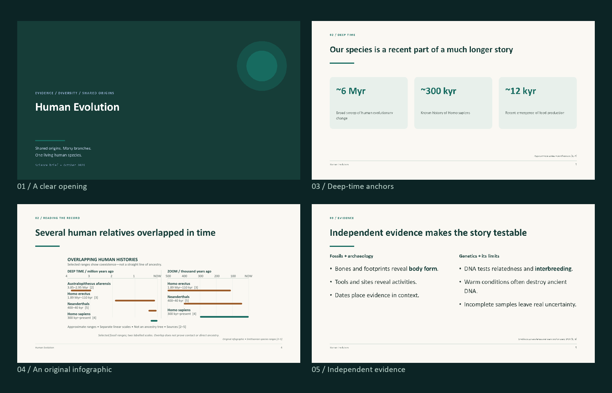
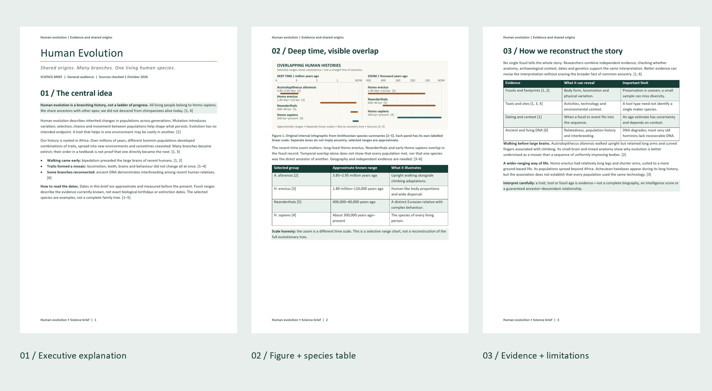
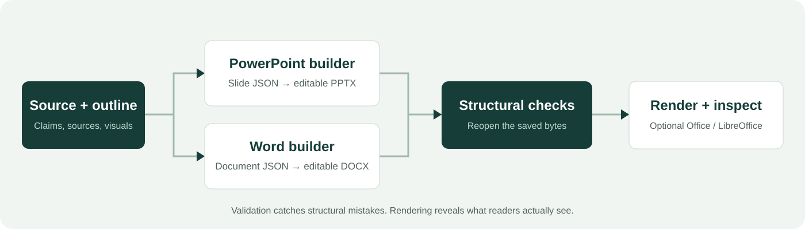

<p align="center">
  
</p>

<h1 align="center">PPTX Generator <span>+ Word Generator</span></h1>

<p align="center"><strong>Turn a clear idea into files people can actually edit.</strong><br />Two focused agent skills. One disciplined content-to-delivery workflow.</p>

<p align="center">
  <a href="https://www.python.org/"></a>
  <a href="ppt_skill/SKILL.md"></a>
  <a href="word_skill/SKILL.md"></a>
  <a href="LICENSE"></a>
</p>


<p align="center">
  <a href="#quick-start">Quick start</a> ·
  <a href="#install-as-agent-skills">Install skills</a> ·
  <a href="#see-the-output">See the output</a> ·
  <a href="#what-you-get">Features</a> ·
  <a href="#validation-without-the-hype">Validation</a> ·
  <a href="#contributing">Contribute</a>
</p>

---

## Why this exists

Generated Office files are easy to make—and surprisingly easy to make badly.
Text collides. Tables grow into footers. A beautiful chart becomes an uneditable
screenshot. A “fade” exists only in the speaker notes.

These skills turn structured outlines into **normal `.pptx` and `.docx` files**,
then reopen the saved packages to check their structure. The workflow encourages
real sources, restrained design, accessible figures and rendered inspection.

> **Editable where it matters.** Slide text, tables, charts and shapes remain
> editable. Word uses real headings and tables. Imported photographs and
> infographics remain images—not magically editable vectors.

## See the output

### A paired science brief, not two unrelated files

The human-evolution example shares one source register and original infographic
between a **12-slide presentation** and a **five-page Word brief**. Both saved
files were opened and exported in desktop Microsoft Office during local review.





**One idea. Two media.** Slides carry the argument; the document carries the
explanation, caveats and linked references. The graphics above are real rendered
outputs, not browser recreations. The banner is an original editorial illustration.

- [Read the shared content and source register](examples/human-evolution.json).
- [Inspect the original scalable infographic](docs/assets/human-evolution-infographic.svg).
- [Run the paired example](#build-the-human-evolution-example) to generate the files locally.

The science example deliberately avoids the misleading “march of progress”:
separate approximate time ranges show overlap without claiming a complete family tree.

## What you get

| | PowerPoint skill | Word skill |
|---|---|---|
| **Output** | Editable, widescreen `.pptx` | Editable, A4 `.docx` |
| **Structure** | 24 layouts on a shared grid | Semantic headings and readable sections |
| **Evidence** | Source lines + speaker notes | Numbered, clickable references |
| **Data** | Native charts and measured tables | Real tables with repeating headers |
| **Visuals** | Contained images with alt text | Captioned images with alt text |
| **Quality gates** | Bounds, text estimates, collisions, table growth, transition XML | Package integrity, headings, image bounds, alt text, table-header checks |
| **Finishing** | Genuine embedded slide transitions | Page fields, running headers, kept-together headings |

### Small dependencies. No second rendering engine.

- [python-pptx](https://python-pptx.readthedocs.io/) builds PowerPoint objects.
- [python-docx](https://python-docx.readthedocs.io/) builds Word objects.
- Pillow and lxml arrive through these libraries; there is no matplotlib dependency.
- Microsoft Office or LibreOffice is **optional** for visual review, not required to build.

## Quick start

Clone the repository, choose your dependencies, and build a real file:

```bash
git clone https://github.com/tejasrajm46-strix/skill_ppt_generator.git
cd skill_ppt_generator
python -m pip install python-pptx python-docx
```

Python **3.8+** is the source-code baseline. Use dependency releases compatible
with your interpreter; a current Python release is recommended for new installs.
If `python` is unavailable, use your platform's `python3` or `py -3` command.

### PowerPoint in three commands

```bash
python ppt_skill/scripts/build_deck.py examples/quick-start.json -o deck.pptx
python ppt_skill/scripts/transitions.py deck.pptx --preset fade --duration 700
python ppt_skill/scripts/validate_deck.py deck.pptx --expect 5 --strict
```

### Word in two commands

```bash
python word_skill/scripts/build_doc.py examples/word-quick-start.json -o brief.docx
python word_skill/scripts/validate_doc.py brief.docx --strict
```

`--strict` fails on warnings as well as errors. `--json` returns a
machine-readable report. A structural pass is **not** a visual approval.

<details>
<summary><strong>Prefer a project-local dependency folder?</strong></summary>

Install without changing global Python packages:

```bash
python -m pip install --target .local-python python-pptx python-docx
```

**Bash / Git Bash**

```bash
export PYTHONPATH="$PWD/.local-python"
```

**PowerShell**

```powershell
$env:PYTHONPATH = Join-Path (Get-Location) '.local-python'
```

Then run the same build and validation commands above. `.local-python/` is ignored
by Git and never included in skill archives.

</details>

## Install as agent skills

For agents that discover `SKILL.md` folders under `~/.agents/skills/`, install
the two folders with names matching their frontmatter:

**Bash / Git Bash**

```bash
mkdir -p ~/.agents/skills
cp -r ppt_skill ~/.agents/skills/pptx-generator
cp -r word_skill ~/.agents/skills/word-generator
```

**PowerShell**

```powershell
$skills = Join-Path $HOME '.agents/skills'
New-Item -ItemType Directory -Force $skills | Out-Null
Copy-Item -Recurse ppt_skill (Join-Path $skills 'pptx-generator')
Copy-Item -Recurse word_skill (Join-Path $skills 'word-generator')
```

These commands assume the destination skills are not already installed. Back up
or deliberately replace an existing copy rather than accidentally nesting folders.
Other agent clients may use a different skill directory; follow their discovery rules.

### Make portable skill-only ZIPs

```bash
python tools/package_skill.py --version v1.1.0
python tools/package_skill.py --skill word --version v1.0.0
```

Produces `pptx-generator-v1.1.0.zip` and `word-generator-v1.0.0.zip`. Each archive
contains **only its skill**—instructions, scripts, references, evaluation prompts
and tests. No generated decks, documents, previews or dependency caches.

The existing tag-triggered [release workflow](.github/workflows/release.yml)
publishes the PowerPoint archive. Word archives can currently be packaged locally;
the workflow does not yet publish both skills automatically.

## Ask for the outcome

An agent with the relevant skill installed can start from plain language:

| Goal | Example prompt |
|---|---|
| **Teach a topic** | “Create a 12-slide presentation about human evolution for a general audience, with sources and speaker notes.” |
| **Write a brief** | “Make a professional Word brief with an executive summary, evidence table, limitations and linked references.” |
| **Deliver both** | “Turn this research into a Word report and an accompanying slide deck. Share sources and figures, but adapt the detail.” |
| **Improve readability** | “Rebuild these slides with consistent geometry and split dense content instead of shrinking it below a readable size.” |
| **Add real transitions** | “Embed subtle fades—not just notes describing transitions.” |

For rebuilding an existing file, the agent must first extract and review the
content; the JSON builders do not automatically ingest arbitrary Office files.

## One source → two editable formats



1. **Understand:** audience, purpose, length and the user's source material.
2. **Outline:** one takeaway per slide; a clear reading order for the document.
3. **Source:** verify claims, preserve uncertainty, and register figure provenance.
4. **Build:** use the medium-specific JSON specification and existing builder.
5. **Check:** reopen the saved file; fix errors and investigate warnings.
6. **Render:** inspect actual pages/slides when an Office renderer is available.
7. **Deliver:** state exactly what was checked—never claim visual perfection from XML alone.

### Build the human-evolution example

```bash
python tools/build_human_evolution.py
python ppt_skill/scripts/validate_deck.py outputs/human-evolution/human-evolution.pptx --expect 12 --strict
python word_skill/scripts/validate_doc.py outputs/human-evolution/human-evolution.docx --strict
```

Outputs live in `outputs/human-evolution/`: DOCX, PPTX, original PNG/SVG
infographic and the assembled JSON specifications. The example illustration uses
**installed Windows Calibri**; the two general skill builders are portable Python.
No downloaded stock photos or template artwork are needed.

[tools/check_deliverables.py](tools/check_deliverables.py) is an additional
example check that expects the **17 Office-rendered proof images** to already
exist. It does not generate them and is not required for the basic build.

## The specifications

JSON is the boundary between content and presentation. No bespoke Python file is
needed for every deck or report.

<details>
<summary><strong>Minimal PowerPoint specification</strong></summary>

```json
{
  "title": "A Clearer Project Story",
  "theme": {"primary": "163D38", "accent": "176B60", "bg": "FAF8F3"},
  "slides": [
    {"layout": "title", "title": "A Clearer Project Story", "subtitle": "One point worth remembering"},
    {"layout": "bullets", "title": "Clarity starts before formatting",
     "bullets": ["Choose **one audience**.", "Make the title a claim.", "Keep the detail in speaker notes."],
     "notes": "Expand the reasoning here, rather than filling the slide."},
    {"layout": "closing", "title": "Make the next step clear", "text": "Questions welcome."}
  ]
}
```

Every slide accepts `notes` and `source`. Image fields resolve relative to the
specification file when using the CLI. See the complete
[PowerPoint schema and layout reference](ppt_skill/SKILL.md).

</details>

<details>
<summary><strong>Minimal Word specification</strong></summary>

```json
{
  "title": "A Clearer Project Brief",
  "subtitle": "Evidence before decoration",
  "sections": [
    {"heading": "Executive summary", "blocks": [
      {"text": "Start with **one central takeaway**."},
      {"type": "callout", "text": "Keep the next action explicit."}
    ]},
    {"heading": "What happens next", "blocks": [
      {"type": "bullets", "items": ["Review the evidence.", "Validate the saved file.", "Inspect the rendered pages."]}
    ]}
  ]
}
```

Supported blocks: `paragraph`, `bullets`, `callout`, `image`, `table`,
`references`. See the complete [Word schema and workflow](word_skill/SKILL.md).

</details>

## 24 PowerPoint layouts

| Family | Layouts | Best fit |
|---|---|---|
| **Editorial** | `title`, `section`, `bullets`, `two_column`, `stats`, `timeline`, `quote`, `table`, `chart`, `image`, `stack`, `closing` | Argument, evidence, comparisons and readable data |
| **Cinematic / technical** | `hero`, `split`, `statement`, `hero_stat`, `network`, `forces`, `cutaway`, `journey`, `flow`, `compare`, `trinity`, `sequence` | Technical explanations and diagram-heavy stories |

Some cinematic layouts contain **ocean-specific motifs**; they are not generic
skins for every subject. Choose the layout for its content, not merely its effect.

Useful limits: timelines accept **2–6 items**, stacks accept **up to 8 bands**.
Keep tables to roughly five columns and split dense slides rather than squeezing
content into tiny type. Native chart types: `bar`, `hbar`, `line`, `area`, `pie`,
`doughnut`. Bar axes start at zero; chart units are visible.

## Validation without the hype

| PowerPoint checks | Word checks |
|---|---|
| Package reopens; expected slide count | Package reopens; document contains text |
| Actual aspect ratio and shape bounds | Semantic Heading 1 paragraphs |
| Estimated text fit and table growth | Image width within the text region |
| Text/table/chart/picture collisions | Descriptive image alt text |
| Transition effects, ordering and namespace scope | Repeating table headers |
| Small explicit type and missing picture alt text | Small explicit type and title metadata |

### What it does not prove

- Text estimates are heuristics, not a font-layout engine.
- Inherited template typography is not fully resolved.
- Raster-image labels cannot be measured by the package validator.
- Word pagination, widows and unusually large table rows need rendered inspection.
- Embedded transitions are structurally checked; playback requires PowerPoint.
- Font substitution can change layout on another machine. Fonts are not embedded.

The PPT builder uses a **12pt body-fit floor**, while some captions, diagram labels
and footer/source furniture intentionally use smaller type. The package validator's
non-furniture warning threshold is 10pt; this is not a promise that every text run
is 12pt or projector-ready.

> A notable regression: transition XML originally declared `p14` only on a child,
> while the slide root named it in `mc:Ignorable`. Python could parse the file;
> desktop PowerPoint refused to open it. The declaration now lives at the root,
> and both validator and regression checks guard the failure.

### Run the checks

```bash
python ppt_skill/tests/test_layout_rules.py
python word_skill/tests/test_doc_rules.py
```

The current suite includes **11 PowerPoint regression checks** and an
assert-based Word round-trip check covering styles, references, tables, alt text
and invalid input. The Word test also uses Pillow (already included with
python-pptx in the combined setup).

Skill evaluation prompts live in [PPT evals](ppt_skill/evals/evals.json) and
[Word evals](word_skill/evals/evals.json). The human-evolution task was exercised
sequentially; independent A/B skill benchmarks and trigger-accuracy scores have
**not** been established.

## Explore the examples

| Example | What it demonstrates |
|---|---|
| [Quick-start deck](examples/quick-start.json) | Five slides: cover, claims, metrics, measured table, closing. Business figures are illustrative. |
| [Quick-start document](examples/word-quick-start.json) | Executive summary, callout, real table and checklist. |
| [Blue LED](examples/blue-led-deck.json) | A 15-slide editorial science story with timelines, chart, stack and tables. |
| [Ocean deck](examples/ocean-deck.json) | A 15-slide cinematic technical deck with cross-sections, network and sequence layouts. |
| [Human evolution](examples/human-evolution.json) | Shared sources and original infographic across PPTX and DOCX. |

[Blue LED transition map](examples/blue-led-transitions.json) ·
[Ocean transition map](examples/ocean-transitions.json)

## Architecture

| Owner | Responsibility |
|---|---|
| [textmetrics.py](ppt_skill/scripts/textmetrics.py) | Shared estimates for lines, column widths and row heights |
| [build_deck.py](ppt_skill/scripts/build_deck.py) | Slide geometry, themes and native PowerPoint objects |
| [transitions.py](ppt_skill/scripts/transitions.py) | Real OOXML slide-transition postprocessing |
| [validate_deck.py](ppt_skill/scripts/validate_deck.py) | Independent saved-package structural inspection |
| [build_doc.py](word_skill/scripts/build_doc.py) | Word specification checks and document formatting |
| [validate_doc.py](word_skill/scripts/validate_doc.py) | Word package, headings, image and table checks |
| [package_skill.py](tools/package_skill.py) | Deterministic skill-only ZIP packaging |
| [build_human_evolution.py](tools/build_human_evolution.py) | Shared example assembly and original illustration |

The measurement policy has one owner: `textmetrics` feeds both PPT builder and
validator. Word and PowerPoint remain separate, independently installable skills;
they share sources and assets when the task asks for both.

<details>
<summary><strong>Repository map</strong></summary>

```text
ppt_skill/                 PowerPoint skill: instructions, scripts, references, evals, tests
word_skill/                Word skill: instructions, scripts, references, evals, tests
examples/                  Runnable specifications and shared science content
tools/                     Packaging, paired-example assembly and optional proof tools
docs/assets/               Original logo, banner, workflow and real output previews
docs/brand/                Identity brief and logo exploration
.github/workflows/         Existing PowerPoint release verification and publishing
```

Generated outputs, dependency folders and review workspaces are ignored. Small,
curated README images are intentionally versioned under `docs/assets/`.

</details>

## Rendering and templates

For an installed LibreOffice renderer, a PDF reading copy can be exported with:

```bash
soffice --headless --convert-to pdf --outdir previews deck.pptx
soffice --headless --convert-to pdf --outdir previews brief.docx
```

Microsoft Office can also export PDF and slide PNGs. The optional
[Windows PDF rasterizer](tools/render_office.ps1) turns an existing PDF into
page PNGs; despite its name, it does not automate Office export:

```powershell
powershell -NoProfile -File tools/render_office.ps1 -Pdf previews/brief.pdf -OutputPrefix previews/page
```

`build_deck.py --base template.pptx` opens the supplied base and appends generated
slides. It retains existing slides, uses a blank layout, and applies explicit
specification styling. It is **not** a full theme-transfer or content-replacement
system; adjust expected slide counts accordingly.

## Contributing

Focused improvements beat another framework. For a change:

1. Keep content out of rendering code and measurement policy in one place.
2. Add the smallest regression check that fails on the original problem.
3. Run the suites and strict validators on the relevant example.
4. Render and inspect layout changes when an Office renderer is available.
5. State limitations honestly—especially around templates, fonts and evidence.

Useful next contributions: broader template tests, rendered regression coverage,
and release packaging for both skills. Please do not bundle third-party logo
libraries, private source material or generated review folders.

## Brand and license

The original **Frame Shift** mark uses two opposing alignment corners: content
moves into a clear frame without tying the project to a single file format.
[Logo SVG](docs/assets/logo.svg) · [Brand guide](docs/brand/README.md) ·
[Identity brief](docs/brand/brief.md)

Code and original repository artwork are available under the **[MIT license](LICENSE)**.
Third-party names and trademarks belong to their owners. The original mark has
not undergone legal trademark clearance. Factual source pages retain their own
rights; citations are not a claim of ownership.

<p align="center"><strong>Make the idea clear. Keep the file editable. Check what you ship.</strong></p>
