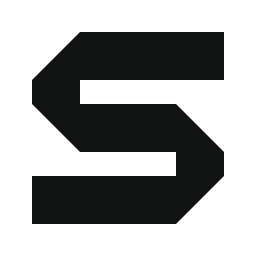

# Awesome Skills — Relay S identity

**Idea:** one routed shape carries an idea into a finished artifact. The angular
S is an identifier, not a collage of Office icons. It works in one color and
remains format-neutral as the toolkit expands.

## Production files

- [Lime symbol master](../assets/logo.svg)
- [Black](../assets/logo-black.svg) · [white](../assets/logo-white.svg)
- [Dark horizontal lockup](../assets/brand-lockup.svg)
- [Light horizontal lockup](../assets/brand-lockup-light.svg)
- [Stacked lockup](../assets/brand-stacked.svg)
- [512px transparent PNG](../assets/logo.png)
- [App icon](icons/relay-app-icon.svg) · [favicon](icons/favicon.ico)
- [README hero](../assets/hero.png) · [editable SVG hero](../assets/hero-multiskill.svg)
- [Concept exploration](concepts/overview.png)

The mark uses a single filled path. Lockup letterforms are outlined from Geist
under its SIL Open Font License, not live font-dependent SVG text. The hero is
an original editorial illustration with outlined type and geometric artifacts.
The trademark/reference logo library supplied with the design skill is excluded.

## Palette

| Role | Color |
|---|---|
| Graphite | `#111412` |
| Electric lime | `#CDF56B` |
| Warm white | `#F5F6EE` |
| Muted sage | `#AEBEAC` |
| Light-surface teal | `#176B60` |

Use lime on graphite, black/teal on light surfaces, and white on dark surfaces.
Do not use lime for small text on white. Use clear space of at least one stem
width around the visible mark. Recommended symbol minimum: 24px; the 16px favicon
is provided as a tested small raster export.

Do not stretch, rotate, add effects to the master, separate parts of the S or
place it on busy artwork. Use the standalone mark or stacked lockup when a long
horizontal wordmark would become too small.

## Process and verification

The user-supplied logo-design skill guided category research, three original
concepts, grayscale comparison, SVG audits and export. Relay S was approved by
the user. The symbol audit has no structural findings; the lockup's font-derived
angles/anchor complexity are intentional typography, not a production fault.
Preview checks cover small sizes, dark/light backgrounds and repository context.
Audit scores are heuristics, not artistic quality scores or legal clearance.

Original symbol and artwork are under repository MIT. Geist remains under
[OFL](../assets/fonts/OFL.txt). Source generator:
[build_brand.py](../../tools/build_brand.py). Trademark clearance and print-color
proofing have not been performed. No OneTake video or runtime is published.
